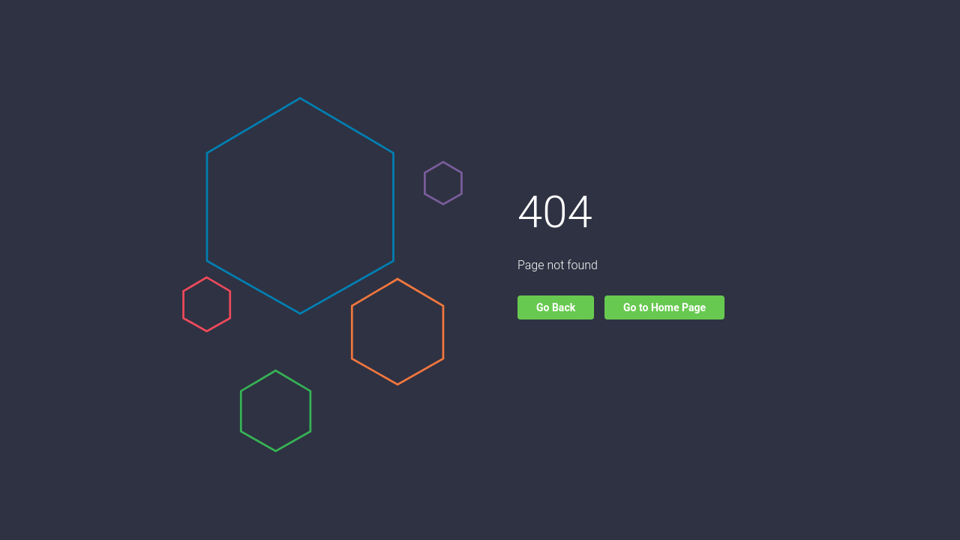

# 404 View

## Mockup

> Code to 404 can be found [here](https://codepen.io/saransh/pen/aezht)
> Code to navbar can be found [here](https://codepen.io/aaroniker/pen/rNMmZvq)

## Requirements

- route is `/404`
- programmatically redirect here for polls or pages that don't exist. If such poll or page is accessed from browser search, then show login first before 404
- Add recommended polls below redirect buttons

> The application asks the user to sign in and shows a 404 page if that poll does not exist. (In other words, if a user creates a poll and then the same or another user tries to access that poll by its url, the user should be asked to sign in and then be shown a 404 page. Please keep in mind that new polls will not be accessible at their url because of the way the backend is set up in this application.)

## Components

- [ ] App

  - [ ] Loading Bar
  - [ ] Loading Screen
  - [ ] Toast
  - Children
    - [ ] Layout
      - [ ] Navbar
      - [ ] UserCard
      - Children
        - [ ] 404
          - [ ] QuestionList
            - [ ] QuestionItem
