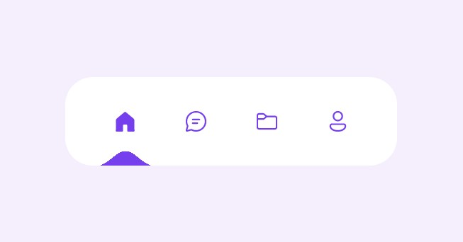

# Add View

## Mockup

> Code to navbar can be found [here](https://codepen.io/aaroniker/pen/rNMmZvq)

## Requirements

- route is `/add`
- the application shows the text **_Would You Rather_** and has a form for creating two options.
- upon submitting the form, a new poll is created and the user is taken to the home page

## Components

- [ ] App

  - [ ] Loading Bar
  - [ ] Loading Screen
  - [ ] Toast
  - Children
    - [ ] Layout
      - [ ] Navbar
      - [ ] UserCard
      - Children
        - [ ] QuestionForm
