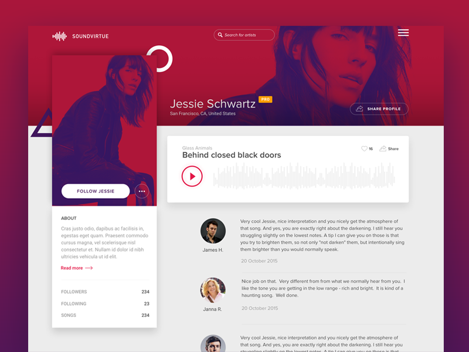

# Home View

## Mockup

> Code to navbar can be found [here](https://codepen.io/aaroniker/pen/rNMmZvq)

## Requirements

- route is `/`
- contains a navigation bar that is visible on all of the pages
- shows
  - on navbar redirect
  - after successful login on app load or navigation through browser url
- answered and unanswered polls are both available
- user can alternate between viewing answered and unanswered polls
- unanswered questions are shown by default
- name of the logged in user is visible on the page.
- user can navigate to the leaderboard.
- user can navigate to the form that allows the user to create a new poll
- each polling question resides in the correct category. For example, if a question hasn’t been answered by the current user, it should be in the _Unanswered_ category.
- a polling question links to details of that poll.
- polls in both categories are arranged from the most recently created (top) to the least recently created (bottom)

## Components

- [ ] App

  - [ ] Loading Bar
  - [ ] Loading Screen
  - [ ] Toast
  - Children
    - [ ] Layout
      - [ ] Navbar
      - [ ] UserCard
      - Children
        - [ ] HomeContainer
          - [ ] QuestionSwitch
          - [ ] QuestionList
            - [ ] QuestionItem
