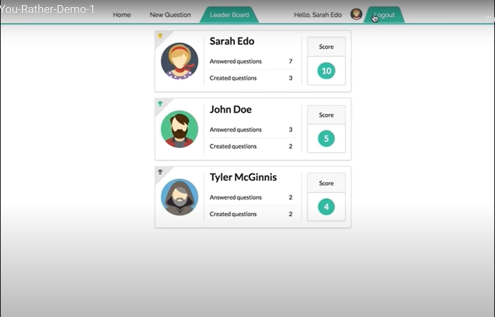

# Leaderboard View

## Mockup

## Requirements

- route is `/leaderboard`
- contains a navigation bar
- Each entry on the leaderboard contains the following:

  - the user’s name;
  - the user’s picture;
  - the number of questions the user asked; and
  - the number of questions the user answered

- Users are ordered in descending order based on the sum of the number of questions they’ve answered and the number of questions they’ve asked

## Components

- [ ] App

  - [x] Loading Bar
  - [ ] Loading Screen
  - [ ] Toast
  - Children
    - [x] Layout
      - [x] Navbar
      - [x] UserCard
      - Children
        - [x] UserCard
