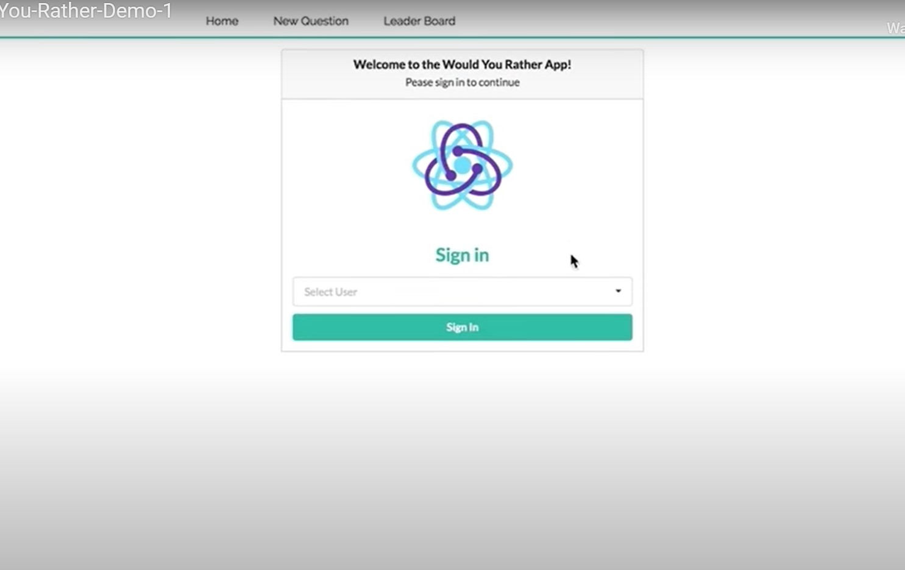
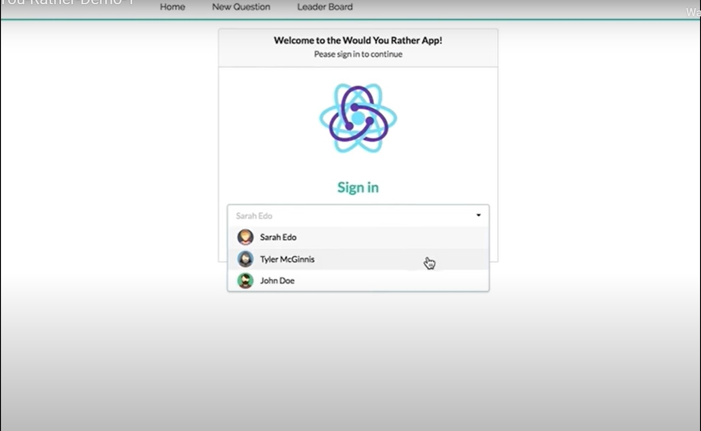
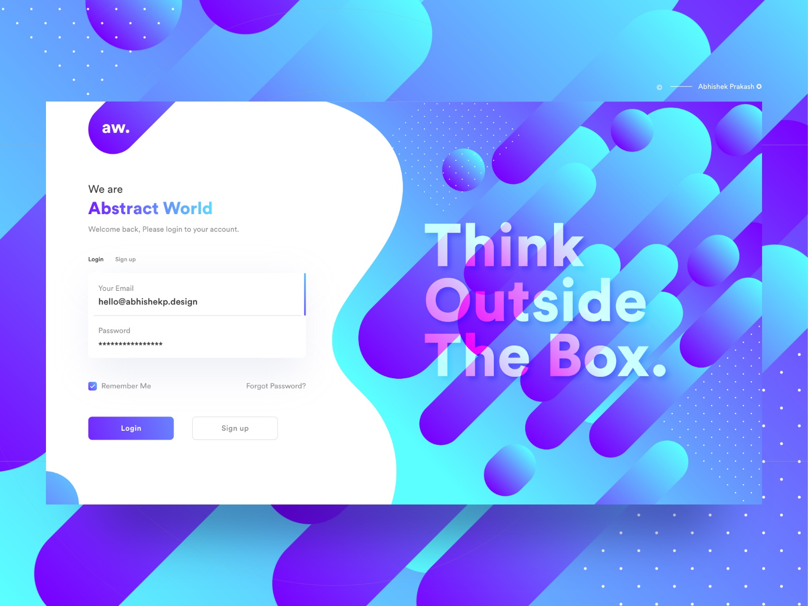

# Login View

## Mockup

## Requirements

- route is `/login`
- all of it is shown on app startup, after loading screen and | or bar
- on successful login(choosing a user)
  - on app startup: load homepage
  - on visiting a page: load that page

## Components

- [x] App

  - [x] Loading Bar
  - [ ] Loading Screen
  - [ ] Toast
  - Children
    - [x] Layout
      - [x] Navbar
      - Children
        - [x] Login
          - [x] UserCard: shows only _avatarURL_ and _name_
