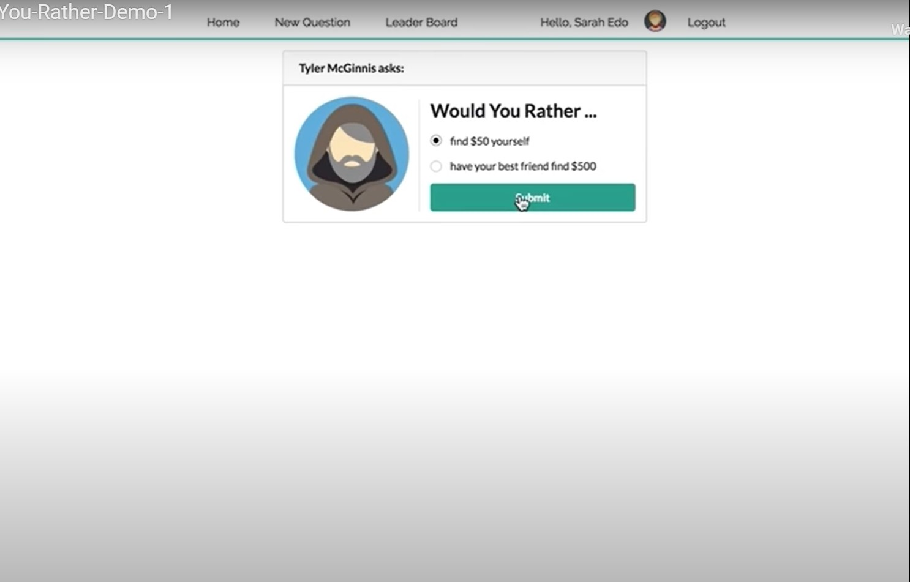
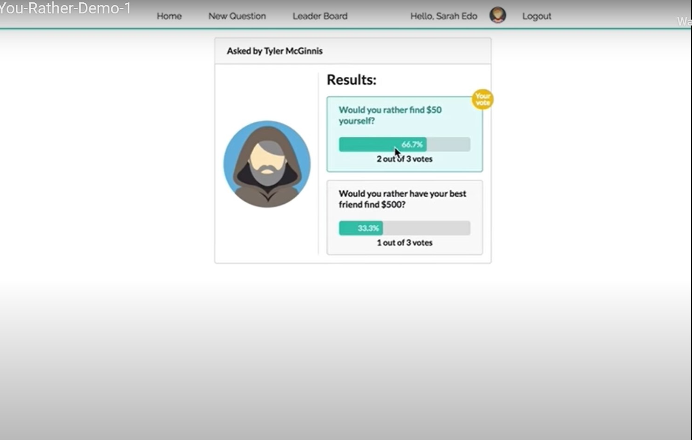

# Questions View

## Mockup

## Requirements

- route is `/questions/:question_id`
- when the user is logged in, the details of the poll are shown. If the user is logged out, he/she is asked to log in before before being able to access the poll
- shows for a poll:
  - the text “Would You Rather”
  - the picture of the user who posted the polling question
  - the two options
- shows for an answered poll:
  - the text of the option
  - the number of people who voted for that option
  - the percentage of people who voted for that option
  - the option selected by the logged in user clearly marked
- asks the user to sign in and redirects to notfound if that poll does not exist
- upon voting in a poll, all of the information of the answered poll is displayed

## Components

### Unanswered Poll

- [ ] App

  - [x] Loading Bar
  - [ ] Loading Screen
  - [ ] Toast
  - Children
    - [x] Layout
      - [x] Navbar
      - [x] UserCard
      - Children
        - [x] QuestionDisplay
          - [x] QuestionAnswerForm

### Answered Poll

- [ ] App

  - [x] Loading Bar
  - [ ] Loading Screen
  - [ ] Toast
  - Children
    - [x] Layout
      - [x] Navbar
      - [x] UserCard
      - Children
        - [x] QuestionDisplay
          - [x] QuestionResult
