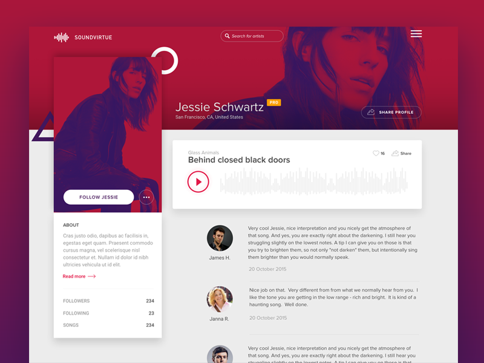
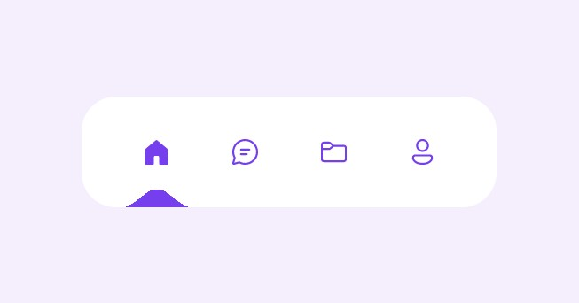

# User Question View

## Mockup

> Code to navbar can be found [here](https://codepen.io/aaroniker/pen/rNMmZvq)

## Requirements

- route is `/questions/:user_id`
- contains a navigation bar
- shows questions added by a particular user

## Components

- [ ] App

  - [ ] Loading Bar
  - [ ] Loading Screen
  - [ ] Toast
  - Children
    - [ ] Layout
      - [ ] Navbar
      - [ ] UserCard
      - Children
        - [ ] OwnerCard
        - [ ] QuestionList
          - [ ] QuestionItem
